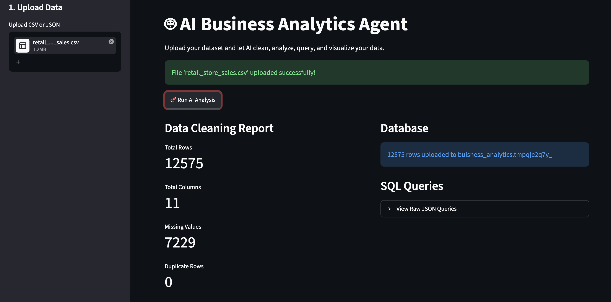
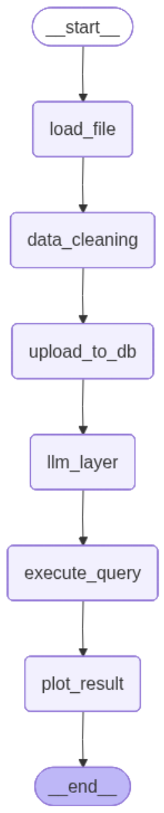
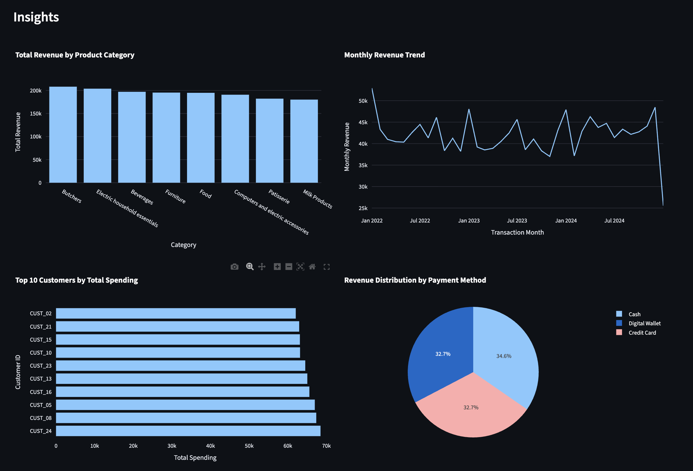

# 🚀 Why AI Business Analytics Agent?

Business Intelligence tools like **Power BI**, **Tableau**, and **Looker** are powerful—but they often require:

- Learning SQL
- Understanding data modeling
- Building dashboards manually
- Designing charts
- Creating measures and calculations
- Significant setup time

For many small businesses, students, startups, and non-technical users, this creates a steep learning curve.

**AI Business Analytics Agent** solves this problem by acting as your personal AI Data Analyst.

Simply upload your dataset, and the AI handles everything—from cleaning the data to generating business insights and interactive dashboards.

---

# Interface

Upload a CSV or JSON dataset and let the AI automatically clean, analyze, query, and visualize your data.

---

# LangGraph Workflow

The complete analytics pipeline is orchestrated using LangGraph, ensuring each stage—from data ingestion to visualization—is executed automatically.

---

# 📊Business Insights

After generating SQL queries, the AI executes them against PostgreSQL and produces interactive Plotly dashboards.

Example insights include:

- 📈 Revenue trends
- 📊 Category performance
- 👥 Top customers
- 💳 Payment method analysis
- 📦 Product performance
- 📉 Comparative business metrics

---

# ✨ Features

### 📂 Upload Your Data

Supports:

- CSV files
- JSON files

No preprocessing required.

---

# 💼 Who Is This For?

This project is designed for anyone who wants business insights **without learning complex BI tools**.

Perfect for:

- 📈 Business Owners
- 🚀 Startup Founders
- 📊 Marketing Teams
- 💰 Sales Teams
- 📦 Inventory Managers
- 🎓 Students
- 📚 Researchers
- 📉 Financial Analysts
- 👨‍💻 Developers building AI products

---

### 🤖 AI-Powered Business Analysis

Instead of manually exploring data, the agent automatically understands your dataset using **Google Gemini 2.5 Flash** and generates meaningful business questions such as:

- Which products generate the highest revenue?
- Who are the top customers?
- What are the monthly sales trends?
- Which payment methods are most popular?
- Which categories perform best?

No SQL knowledge required.

---

### 🗄 Automatic SQL Generation

The AI generates production-ready PostgreSQL queries automatically.

It intelligently creates:

- Revenue analysis
- Category comparisons
- Customer segmentation
- Rankings
- Trend analysis
- Distribution reports
- Aggregated metrics

---

### ⚡ Automatic Database Integration

Your uploaded dataset is automatically:

- Imported into PostgreSQL
- Converted into database tables
- Prepared for analytical querying

No manual database setup required after configuration.

---

### 📊 Smart Visualization Selection

The agent doesn't just generate SQL—it also decides the most appropriate visualization for each insight.

Automatically supports:

- 📊 Bar Charts
- 📉 Horizontal Bar Charts
- 📈 Line Charts
- 🥧 Pie Charts
- 🔵 Scatter Plots
- 📋 Tables

All visualizations are interactive using **Plotly**.

---

### 🧹 Data Quality Report

Before analysis begins, the agent automatically checks:

- Total rows
- Total columns
- Missing values
- Duplicate records
- Dataset summary

This ensures insights are generated from reliable data.

---

# 🌟 Why Choose AI Business Analytics Agent?

| Traditional BI Tools | AI Business Analytics Agent |
|----------------------|-----------------------------|
| Requires dashboard design | AI builds insights automatically |
| Requires SQL knowledge | No SQL required |
| Manual chart creation | Automatic chart selection |
| Time-consuming exploration | Instant business insights |
| Steep learning curve | Upload and analyze |
| Multiple manual steps | Fully automated workflow |

---

# 🎯 End-to-End Workflow

1. Upload your dataset.
2. AI performs data quality analysis.
3. Data is stored in PostgreSQL.
4. Gemini understands the schema.
5. SQL queries are generated automatically.
6. Queries are executed.
7. Interactive Plotly dashboards are created.
8. Business insights are presented in Streamlit.

From raw data to actionable insights—in just a few clicks.
